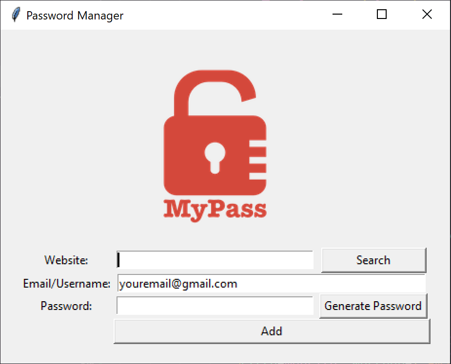

# Password Manager



Password Manager is a simple GUI application built using the Tkinter library in Python. It allows users to generate strong passwords and store their login credentials for different websites securely.

## Features

- Password generation with a mix of letters (uppercase and lowercase), numbers, and symbols.
- Store passwords along with corresponding website URLs and email addresses.
- User-friendly UI with a logo and input fields.
- Option to generate a password or input a custom one.
- Confirmation dialog before saving credentials.

## Prerequisites

To run this application, you need to have Python installed on your system. The Tkinter library is included with most standard Python distributions.

## Getting Started

1. Clone this repository to your local machine.
2. Make sure you have a `logo.png` image file in the same directory as the `main.py` script.
3. Open a terminal/command prompt and navigate to the repository folder.
4. Run the following command to start the Password Manager:
   ```python
   py main.py
   ```
5. The GUI application will open, allowing you to generate passwords and save login details.

## How to Use

1. Enter the website URL in the "Website" field.
2. Optionally, modify the default email/username in the "Email/Username" field.
3. Click the "Generate Password" button to generate a strong password. You can also input a custom password if desired.
4. Click the "Add" button to save the website, email, and password details.
5. Password saved to your clipboard.
6. To retrieve a password, enter the website URL and click the "Search" button.
7. Your password will be displayed in a popup message.
8. The saved data will be stored in the `data.json` file.

## Customization

- Modify the lists of letters, numbers, and symbols in the `generate_password` function to adjust the password complexity.
- You can customize the `logo.png` image to match your preferences.

## Data Storage

The passwords and associated data are stored in the `data.json` file. Make sure to keep this file secure and backed up.

## Note

1. This application is for personal use and is not recommended for managing critical passwords.
2. Make sure to replace the example email in the email entry field with your own email address.
3. The logo image should be placed in the same directory as the script with the name "logo.png".

Feel free to customize and extend this password manager according to your needs.

## Security Note

While this application offers a convenient way to manage passwords, it's important to note that storing passwords in plain text is not recommended for sensitive accounts. Consider using a dedicated password manager tool that provides encryption and other security features.

## Acknowledgements

This project was developed for educational purposes using the Tkinter library in Python.
